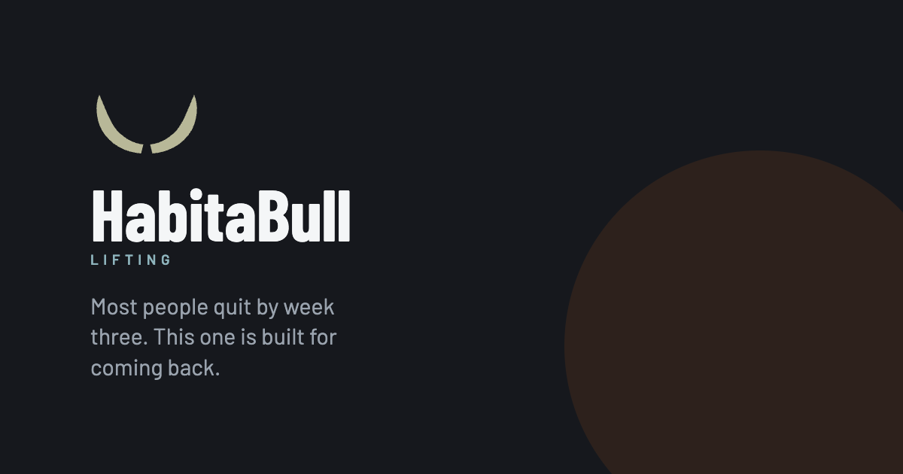

<p align="center">
  
</p>

# HabitaBull Lifting

A gym habit app for people who keep stopping. It builds you a week you can
actually keep, tells you what to lift today, and takes one tap per set. The
argument it makes, everywhere, is that turning up is the job and a gap is not a
failure.

It is a web app you add to your home screen. There is no account and no sign-up:
your plan, your history and your photos live in the browser on your phone and
never leave it, except for the two opt-in features below.

## Running it

```bash
npm install
npm run dev          # http://localhost:3000
```

| Script | What it does |
| --- | --- |
| `npm run dev` | Dev server |
| `npm run build` | Production build |
| `npm run start` | Serve the production build |
| `npm test` | 517 unit tests (vitest, node environment, no DOM) |
| `npm run smoke` | End-to-end check against a live crew backend |
| `npm run shoot` | Re-shoot the screen gallery from `/frames` |

Built on Node 24. No database and no services are required to run it: with an
empty environment the app is fully working, solo and offline.

## Environment

Every variable is optional. Copy `.env.example` to `.env.local` and fill in only
what you want on.

| Variable | What it turns on |
| --- | --- |
| `SUPABASE_URL` | The crew backend. Unset, there is no crew UI at all. |
| `SUPABASE_SERVICE_KEY` | Same. Server-only, read once in `lib/server/db.ts`. It bypasses row-level security, so it must never be prefixed `NEXT_PUBLIC_`. |
| `NEXT_PUBLIC_CREW_ENABLED` | The one flag the browser sees: whether to show crew UI. |

To turn the crew on, make a Supabase project and run `supabase/schema.sql` in
its SQL editor.

## Stack

Next.js 16 (App Router, Turbopack), React 19, TypeScript, Tailwind v4, vitest.
Three runtime dependencies: `next`, `react`, `react-dom`.

State is `localStorage` under `habitabull.v1`, with progress photos in
IndexedDB. A service worker (`public/sw.js`) caches the shell so the app opens
without a signal, which is the normal case in a basement gym. The document is
fetched network-first, so an installed app can never get stuck on an old build.

## Where things are

| Path | What's in it |
| --- | --- |
| `app/` | Routes. `page.tsx` is the whole app: one client component that switches views. |
| `app/frames/` | Every screen at once, on one page, with no flow to walk through. |
| `app/api/` | Three routes: the crew backend, the plan parser, and a build-version check. |
| `components/` | Screens and UI. |
| `lib/` | All the logic, kept pure and tested without a DOM. `engine.ts` is the plan generator. |
| `supabase/schema.sql` | The crew tables, if you want them. |

## What leaves the device

Two things, both off by default and both opt-in:

**The crew.** If configured, it publishes which days you trained and photos you
choose to share. It never carries a weight, a rep or a set. Identity is a
128-bit random id in `localStorage`, and a device can only ever read its own
crew, because the crew id comes from a server-side lookup and never from the
request body.

**The plan parser.** `app/api/generate` relays text you type ("only dumbbells
today, and my shoulder is tweaked") to a third-party model proxy to turn it into
a plan. This is the one path where text you typed leaves the phone. It is
unauthenticated and unthrottled, the model's answer is validated against a fixed
list before anything is used, and if the proxy is slow or down a local parser
handles it instead, so the feature degrades rather than breaking.

## Tests

```bash
npm test
```

517 tests, all in `lib/` next to what they cover. They run in node with no DOM,
which is the reason the logic lives in `lib/` and the components stay thin.
