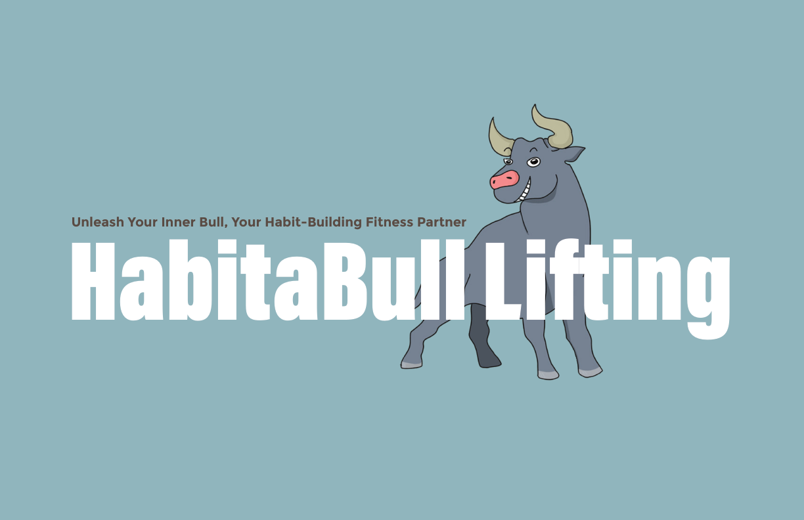

<p align="center">
  
</p>

# HabitaBull Lifting

A gym habit app for people who keep stopping. It builds you a week you can
actually keep, tells you what to lift today, and takes one tap per set. The
argument it makes, everywhere, is that turning up is the job and a gap is not a
failure.

It is a web app you add to your home screen. There is no account and no sign-up:
your plan, your history and your photos live in the browser on your phone and
never leave it, except for the two opt-in features below.

## What it does

| Area | What's there |
| --- | --- |
| Plan | A week generated from how many days you have and what you own, editable by hand in the routine editor, or described in plain text ("only dumbbells today, and my shoulder is tweaked"). Workouts can also be imported by pasting a written routine. |
| Your own workouts | A workout you shaped, saved under a name and put on any day of the week — including one you improvised, which the end-of-session screen offers to keep because nothing else in the app would remember it (`lib/workouts.ts`). |
| Logging | One tap per set, a plate-math view of the bar, a rest timer with a chime, and a comeback path for a day you started and walked away from. |
| Progress | Trained days, consistency, best sets, a body-weight line, and progress photos in a calendar you can open a day of. |
| The bull | A mascot with a fixed voice: he notices you were gone and never punishes you for it (`lib/voice.ts` lists what he is banned from saying). |
| Keeping it | A whole-history backup file you can import anywhere, holding everything the store holds (sessions, notes, photos, weigh-ins, lifts you added, saved workouts), and an `.ics` reminder for your own calendar, because a web app cannot honestly schedule a notification. |
| Music | One pasted Spotify playlist link, opened when a workout starts. No OAuth, no SDK. |
| Crew | Optional and off by default: which days the people you train with turned up, plus photos they chose to share. |

`/frames` renders every screen at once on one page, with no flow to walk
through, which is also what the screenshot script drives.

## Running it

```bash
npm install
npm run dev          # http://localhost:3000
```

| Script | What it does |
| --- | --- |
| `npm run dev` | Dev server |
| `npm run build` | Production build |
| `npm run start` | Serve the production build |
| `npm test` | 628 unit tests (vitest, node environment, no DOM) |
| `npm run smoke` | End-to-end check against a live crew backend. Needs a dev server already running and a real Supabase project; it makes a throwaway crew and deletes it. |
| `npm run shoot` | Re-shoot the screen gallery from `/frames`. Needs a production build served on port 3111 and `agent-browser` installed globally. Writes to the `redesign-screens/` folder in the separate portfolio docs directory, not into this repo. |

Built on Node 24. No database and no services are required to run it: with an
empty environment the app is fully working, solo and offline.

## Environment

Every variable is optional. Copy `.env.example` to `.env.local` and fill in only
what you want on.

| Variable | What it turns on |
| --- | --- |
| `SUPABASE_URL` | The crew backend. Unset, there is no crew UI at all. |
| `SUPABASE_SERVICE_KEY` | Same. Server-only, read once in `lib/server/db.ts`. It bypasses row-level security, so it must never be prefixed `NEXT_PUBLIC_`. |
| `NEXT_PUBLIC_CREW_ENABLED` | The one flag the browser sees: whether to show crew UI. |

To turn the crew on, make a Supabase project and run `supabase/schema.sql` in
its SQL editor.

The plan parser needs no key of its own: it posts to a keyless university
Replicate proxy named in `app/api/generate/route.ts`. Swapping providers means
changing the proxy URL, the model and the fetch body, and nothing else.

## Stack

Next.js 16 (App Router, Turbopack), React 19, TypeScript, Tailwind v4, vitest.
Three runtime dependencies: `next`, `react`, `react-dom`.

State is `localStorage` under `habitabull.v1`, with progress photos in
IndexedDB. A service worker (`public/sw.js`) caches the shell so the app opens
without a signal, which is the normal case in a basement gym. The document is
fetched network-first, so an installed app can never get stuck on an old build;
`app/api/version` gives a page that has been open for weeks a way to notice it
has been superseded.

## Where things are

| Path | What's in it |
| --- | --- |
| `app/` | Routes. `page.tsx` is the whole app: one client component that switches between seventeen views. |
| `app/frames/` | Every screen at once, on one page, with no flow to walk through. |
| `app/api/` | Three routes: the crew backend, the plan parser, and a build-version check. |
| `components/` | Screens and UI. |
| `lib/` | All the logic, kept pure and tested without a DOM. `engine.ts` is the plan generator. |
| `lib/server/` | The only code that touches the service key: the database client and the validators every request passes through first. |
| `public/` | Icons, mascot stills, and the service worker. |
| `scripts/` | The crew smoke test and the screenshot shooter. |
| `art/` | Mascot sources, including the 2023 originals the current one is drawn from. |
| `ios/` | A Capacitor shell that loads the deployed site in a native wrapper, for a TestFlight build. Nothing in the web app depends on it, and its tooling is deliberately absent from `package.json`. |
| `docs/superpowers/` | Designs and implementation plans, written before the code they describe. |
| `supabase/schema.sql` | The crew tables, if you want them. |

Design notes, brand files, UX test write-ups and the shot gallery live outside
this repo, in the `habitabull redesign` portfolio docs folder.

## What leaves the device

Two features, both off by default and both opt-in:

**The crew.** If configured, it publishes which days you trained, photos you
choose to share, and the captions and replies you type on them. It never
carries a weight, a rep or a set. Identity is a 128-bit random id in
`localStorage`, and a device can only ever read its own crew, because the crew
id comes from a server-side lookup and never from the request body. Everything
arriving from a browser is validated in `lib/server/validate.ts` before it
reaches a query, since the service key bypasses row-level security.

**The plan parser.** `app/api/generate` relays text you type ("only dumbbells
today, and my shoulder is tweaked") to a third-party model proxy to turn it into
two enum arrays. The model never sees or returns a weight, a set or a rep: the
rules engine owns all of that. It is unauthenticated and unthrottled, the
model's answer is validated against a fixed list before anything is used, and if
the proxy is slow or down a local keyword parser handles it instead, so the
feature degrades rather than breaking.

Two smaller network paths, neither carrying your training: the version check
above, and a tapped Spotify link, which hands a playlist id to whatever app or
web player the phone already has.

## Tests

```bash
npm test
```

628 tests across 31 files, each beside what it covers: 28 under `lib/` (two of
them in `lib/server/`) and three in `components/`, for the pure helpers that
happen to live next to a screen. They run in node with no DOM, which is the
reason the logic lives in `lib/` and the components stay thin.
